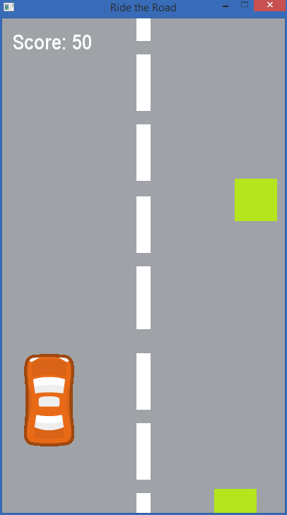

# Ride-the-Road
A simple car game made with [Python-Pygame](http://www.pygame.org).

## To Play this game
* Install Python 3.x from [here](https://www.python.org/downloads/releases)
* Install pygame from [here](https://www.pygame.org/download.shtml).
* Clone this repository.
* Open the terminal/command line and navigate to the directory and type python Ride the Road.py.
* Use <kbd>&larr;</kbd> and <kbd>&rarr;</kbd> to control the car.

### Screenshot

